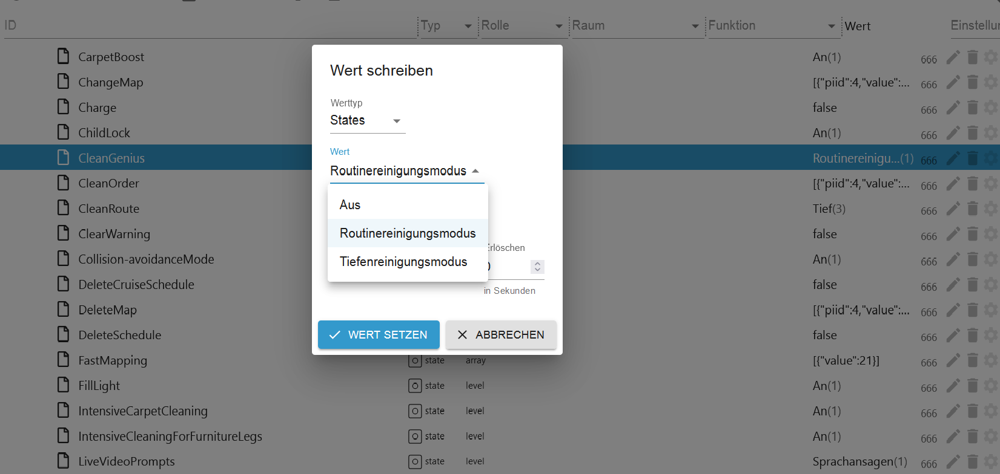
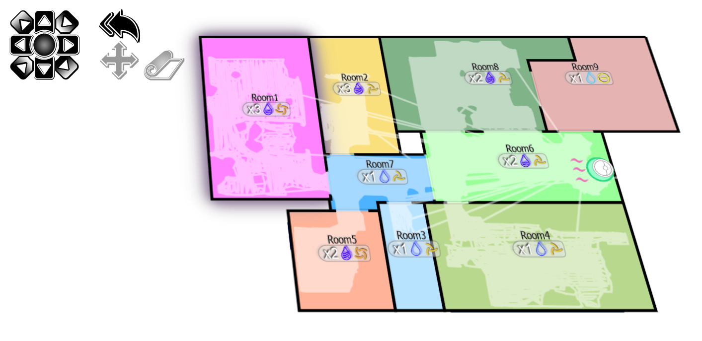

# dreamehome


Dreame Home adapter for ioBroker
# ioBroker.dreamehome

**Attention!!**

**Canvas is required for generating the map. Without it, the adapter will terminate with an error.**

***Check if canvas is installed using the following command:***
```
cd /opt/iobroker/
npm list canvas
```
***If canvas is not installed, run the following command to install it:***
```
cd /opt/iobroker/
npm install canvas
```

***Then, check again by running the first command to ensure that canvas is properly installed.***

*To download the map, please set the object dreamehome.0.xxxxxxxx.map.NewMap to true.*

*To switch between floors, the object dreamehome.0.xxxxxxxx.map.MapNumber must be switched to Map 1 or Map 2.*

*The objects Start-Clean, Update, and Restart are currently disabled..*


## Changelog

$${\color{red}The \space question \space of \space how \space to \space format \space the \space created \space VIS.HTML \space has \space come \space up.}$$ To do this, copy the content from dreamehome.0.xxxxxx.vis.vishtml0 or vishtml1 and format it at https://codebeautify.org/htmlviewer $${\color{blue}(Beautify \space HTML)}$$. Then, create an HTML widget in VIS and paste the formatted content into it.

**0.0.8**

New Features Added:
- Voice Commands Accepted with Alexa Adapter:
    Please note that voice commands will be accepted only if the Alexa adapter is installed and properly configured.
- Voice Commands for Room Cleaning:
    Users can now use voice commands like "Vacuum," "Mop," "Vacuum and Mop," and "Mop after Vacuum" to customize the cleaning process. Voice commands for repetitions (e.g., "clean three times") are also supported.
- Mode Management for Different Cleaning Types:
    A new mechanism has been implemented to distinguish between various cleaning modes:
        . Vacuum and Mop, Mop, Vacuum, Mop after Vacuum
- Automatic Activation of CleanGenius:
    If no specific cleaning mode is mentioned, the CleanGenius mode will be automatically set to true; otherwise, it will be set to false.
- Multiple Rooms with Different Settings:
    The adapter now supports cleaning multiple rooms with different cleaning modes. Users can specify different cleaning actions for each room.
- Enhanced Voice Command Processing:    The voice commands for room cleaning have been improved to correctly recognize combinations such as "Vacuum in the living room and mop in the bathroom."
- Optimized Room Assignment:
    The assignment of cleaning modes and repetitions to multiple rooms has been optimized to allow for more precise execution.

  **Example Voice Commands:**
    1. "Vacuum the living room"
   
    *Expected Outcome: The robot will start vacuuming the living room using the Vacuum mode (Mode 5122).*
   
    2. "Mop the kitchen"
   
    *Expected Outcome: The robot will start mopping the kitchen using the Mop mode (Mode 5121).*
   
    3. "Vacuum and mop the bedroom"
   
    *Expected Outcome: The robot will first vacuum the bedroom and then mop it using Vacuum and Mop mode (Mode 5120).*
   
    4. "Mop after vacuum in the hallway"
   
    *Expected Outcome: The robot will first vacuum the hallway and then mop it using the Mop after Vacuum mode (Mode 5123).*
    
    5. "Clean the bathroom three times"
   
    *Expected Outcome: The robot will clean the bathroom using the default cleaning mode (either Vacuum or Mop, depending on the command) and repeat it 3 times.*
   
    6. "Clean the living room and the kitchen"
    
    *Expected Outcome: The robot will clean both the living room and the kitchen, each with the default cleaning mode. If no mode is specified, Vacuum and Mop mode (Mode 5120) will be applied by default.*

   **Beispiel-Sprachbefehle:**
    1. "Staubsauge das Wohnzimmer"
    
    *Erwartetes Ergebnis: Der Roboter beginnt, das Wohnzimmer mit dem Staubsaugmodus (Modus 5122) zu reinigen.*

    2. "Wische die Küche"
   
    *Erwartetes Ergebnis: Der Roboter beginnt, die Küche mit dem Wischmodus (Modus 5121) zu reinigen.*
   
    3. "Staubsaugen und Wischen im Schlafzimmer"
    
    *Erwartetes Ergebnis: Der Roboter wird zuerst das Schlafzimmer saugen und danach wischen, im Staubsaugen und Wischen Modus (Modus 5120).*
    
    4. "Wischen nach dem Saugen im Flur"
    
    *Erwartetes Ergebnis: Der Roboter wird zuerst den Flur saugen und danach wischen, im Wischen nach Saugen Modus (Modus 5123).*
   
    5. "Reinige das Badezimmer drei Mal"
    
    *Erwartetes Ergebnis: Der Roboter wird das Badezimmer mit dem Standard-Reinigungsmodus (entweder Staubsaugen oder Wischen, je nach Befehl) reinigen und dies 3 Mal wiederholen.*
    
    6. "Reinige das Wohnzimmer und die Küche"
    
    *Erwartetes Ergebnis: Der Roboter wird sowohl das Wohnzimmer als auch die Küche reinigen, wobei der Standard-Reinigungsmodus verwendet wird. Falls kein Modus angegeben ist, wird der Staubsaugen und Wischen Modus (Modus 5120) verwendet.*

**0.0.7**
- Fix for Command Execution Issues Due to Domain Changes from Dreame
- New Control Features Added:


**0.0.6**
New Control Features Added:
- Resume Clean Mode: Off/On
- Child Lock: Off/On
- Auto Add Detergent: Off/On
- Auto Mount Mop: Off/On
- Clean Genius: Off/Routine Cleaning/Deep Cleaning
- Smart Auto Wash: Off/Works in Deep Mode/Works in Routine & Deep Mode
- Smart Auto Mop: Off/Works in Deep Mode/Works in Routine & Deep Mode
- Carpet Boost: Off/On
- Intensive Carpet Cleaning: Off/On
- Mop Scalable: Intelligence/Standard/High Frequency
- Mop Extension for Gap Cleaning: Off/On
- Intensive Cleaning for Furniture Legs: Off/On
- Fill-in Light: Off/On
- Collision-Avoidance Mode: Off/On
- Clean Route: Quick/Standard/Intensive/Deep
- Live Video Prompts: The camera is blinking/Voice prompts
- Volume: 1 to 100 

Control Adjusted: 
- Automatic switch off of the Genius Mode when the Custom Mode is activated.
- The map folder has been optimized, and objects have been prepared for communication with the generated VIS.HTML
  

  
**0.0.5**
1. The map has been improved and room settings are now visible.
2. Additionally, additional animations have been added to the charging station..
   
   
**0.0.3**
1. An animation has been added for the charging station.
2. Additionally, the history of the robot's position on the map has been corrected, and the map has been improved for better accuracy and user experience.

**0.0.2**
1. Fixed the crash after map download.
2. Added carpet cleaning function  *(To start the carpet cleaning, select the repetition under object CarpetRepetitionX and the suction strength under object CarpetSuctionLevelX, then set the object CleanCarpetX to true)*.
3. Added zone cleaning and spot cleaning features.
4. Room names are now visible under the Map.0 or M.01 folder
  
<!--
    Placeholder for the next version (at the beginning of the line):
    ### **WORK IN PROGRESS**
-->

### **Thanks to**
https://github.com/TA2k/ioBroker.dreame by TA2k

https://github.com/Tasshack/dreame-vacuum by Tasshack

## License

MIT License

Copyright (c) 2020-2025 spayrosam

Permission is hereby granted, free of charge, to any person obtaining a copy
of this software and associated documentation files (the "Software"), to deal
in the Software without restriction, including without limitation the rights
to use, copy, modify, merge, publish, distribute, sublicense, and/or sell
copies of the Software, and to permit persons to whom the Software is
furnished to do so, subject to the following conditions:

The above copyright notice and this permission notice shall be included in all
copies or substantial portions of the Software.

THE SOFTWARE IS PROVIDED "AS IS", WITHOUT WARRANTY OF ANY KIND, EXPRESS OR
IMPLIED, INCLUDING BUT NOT LIMITED TO THE WARRANTIES OF MERCHANTABILITY,
FITNESS FOR A PARTICULAR PURPOSE AND NONINFRINGEMENT. IN NO EVENT SHALL THE
AUTHORS OR COPYRIGHT HOLDERS BE LIABLE FOR ANY CLAIM, DAMAGES OR OTHER
LIABILITY, WHETHER IN AN ACTION OF CONTRACT, TORT OR OTHERWISE, ARISING FROM,
OUT OF OR IN CONNECTION WITH THE SOFTWARE OR THE USE OR OTHER DEALINGS IN THE
SOFTWARE.
